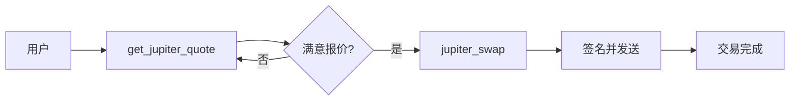
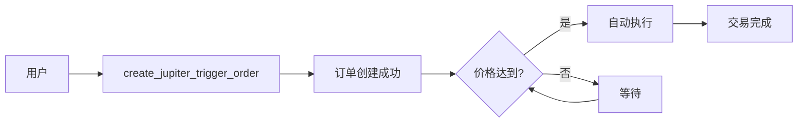
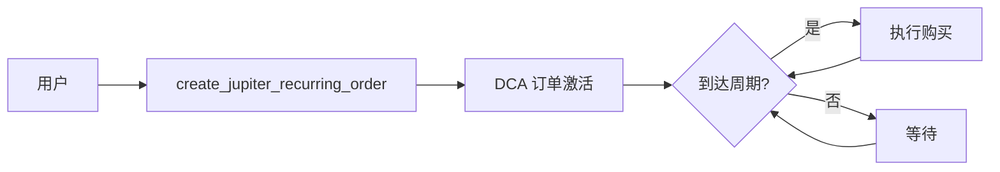
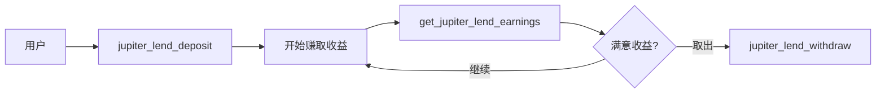

# Jupiter 工具使用指南

**版本**: 1.0
**最后更新**: 2026-01-26
**工具总数**: 53 个（47 静态 + 6 动态）

---

## 📚 目录

1. [概览](#概览)
2. [快速开始](#快速开始)
3. [API 类别](#api-类别)
4. [常见工作流程](#常见工作流程)
5. [钱包集成](#钱包集成)
6. [错误处理](#错误处理)
7. [最佳实践](#最佳实践)
8. [常见问题](#常见问题)

---

## 概览

Jupiter 是 Solana 上最大的 DEX 聚合器，提供：
- **最优路由**: 自动找到最佳交换路径
- **限价单**: Trigger API 支持限价订单
- **DCA**: 定期购买（美元成本平均法）
- **借贷**: Earn 收益
- **代币发射**: Studio DBC

### 工具分类

| 类别 | 工具数 | 主要功能 |
|------|--------|----------|
| **Swap** | 4 | 交换、报价、程序标签 |
| **Price** | 1 | 实时价格查询 |
| **Tokens** | 7 | 代币搜索、标签、类别 |
| **Trigger** | 5 | 限价单管理 |
| **Recurring** | 4 | DCA 订单管理 |
| **Lend** | 7 | 借贷收益 |
| **Ultra** | 7 | 高级交易功能 |
| **Portfolio** | 3 | 仓位查询 |
| **Send** | 4 | 代币转账 |
| **Studio** | 5 | DBC 池管理 |

---

## 快速开始

### 基础交换示例

```json
// 1. 获取报价
{
  "tool": "get_jupiter_quote",
  "params": {
    "input_mint": "So11111111111111111111111111111111111111112",  // SOL
    "output_mint": "EPjFWdd5AufqSSqeM2qN1xzybapC8G4wEGGkZwyTDt1v", // USDC
    "amount": "100000000",  // 0.1 SOL (9 decimals)
    "slippage_bps": 50       // 0.5% 滑点
  }
}

// 2. 构建交换交易
{
  "tool": "jupiter_swap",
  "params": {
    "quote_response": "<步骤1的完整响应>",
    "user_public_key": "你的钱包地址",
    "compute_unit_price_micro_lamports": 1000  // 优先费用（可选）
  }
}

// 3. 签名和发送（使用 Privy）
{
  "tool": "jupiter_swap",
  "params": {
    "quote_response": "<步骤1的响应>",
    "user_public_key": "你的地址",
    "wallet_type": "privy",
    "wallet_id": "你的privy wallet ID"
  }
}
```

---

## API 类别

### 1. Swap API 💱

#### `get_jupiter_quote`
获取最优交换路径和报价。

**参数**:
```json
{
  "input_mint": "代币A地址 (required)",
  "output_mint": "代币B地址 (required)",
  "amount": "数量（base units）(required)",
  "swap_mode": "ExactIn | ExactOut (optional, default: ExactIn)",
  "slippage_bps": "滑点（基点）(optional, default: 50 = 0.5%)",
  "endpoint": "自定义端点 (optional)"
}
```

**返回**:
```json
{
  "chain": "solana",
  "input_mint": "So11...",
  "output_mint": "EPjF...",
  "amount": "100000000",
  "swap_mode": "ExactIn",
  "quote": {
    "inputMint": "So11...",
    "outputMint": "EPjF...",
    "inAmount": "100000000",
    "outAmount": "15234567",
    "otherAmountThreshold": "15157702",
    "swapMode": "ExactIn",
    "slippageBps": 50,
    "priceImpactPct": "0.0123",
    "routePlan": [...]
  }
}
```

#### `jupiter_swap`
构建交换交易（可选自动签名和发送）。

**参数**:
```json
{
  "quote_response": "完整的 quote 响应 JSON (required)",
  "user_public_key": "用户钱包地址 (required)",
  "wrap_unwrap_sol": "自动包装/解包 SOL (optional, default: true)",
  "use_shared_accounts": "使用共享账户 (optional, default: true)",
  "fee_account": "推荐费账户 (optional)",
  "compute_unit_price_micro_lamports": "优先费用 (optional)",

  // 可选：自动签名和发送
  "wallet_type": "privy | local (optional)",
  "wallet_id": "Privy wallet ID (required if wallet_type=privy)",
  "sponsor": "是否赞助交易费用 (optional, default: false)"
}
```

**返回**（未签名）:
```json
{
  "user_public_key": "Abc123...",
  "swap_transaction": {
    "swapTransaction": "base64编码的交易...",
    "lastValidBlockHeight": 123456789
  },
  "endpoint": "https://api.jup.ag/swap/v1/swap"
}
```

**返回**（已签名）:
```json
{
  "user_public_key": "Abc123...",
  "swap_transaction": {...},
  "endpoint": "https://api.jup.ag/swap/v1/swap",
  "signature": "交易签名..."
}
```

#### `execute_jupiter_swap`
一键完成：报价 → 交换 → 签名 → 发送（辅助工具）。

**参数**:
```json
{
  "input_mint": "So11...",
  "output_mint": "EPjF...",
  "amount": "100000000",
  "user_public_key": "你的地址",
  "slippage_bps": 50,
  "wallet_type": "privy",
  "wallet_id": "你的privy wallet ID"
}
```

#### `get_jupiter_program_labels`
获取程序 ID 到名称的映射（用于解析交易）。

---

### 2. Price API 💰

#### `get_jupiter_price`
获取实时代币价格（以 USDC 计价）。

**参数**:
```json
{
  "ids": "代币地址列表（逗号分隔）(required)",
  "show_extra_info": "显示额外信息 (optional, default: false)"
}
```

**示例**:
```json
{
  "tool": "get_jupiter_price",
  "params": {
    "ids": "So11111111111111111111111111111111111111112,EPjFWdd5AufqSSqeM2qN1xzybapC8G4wEGGkZwyTDt1v"
  }
}
```

**返回**:
```json
{
  "data": {
    "So11111111111111111111111111111111111111112": {
      "id": "So11...",
      "type": "derivedPrice",
      "price": "152.34"
    },
    "EPjFWdd5AufqSSqeM2qN1xzybapC8G4wEGGkZwyTDt1v": {
      "id": "EPjF...",
      "type": "derivedPrice",
      "price": "1.0"
    }
  },
  "timeTaken": 0.123
}
```

---

### 3. Tokens API 🪙

#### `search_jupiter_tokens`
搜索代币。

**参数**:
```json
{
  "query": "搜索关键词 (required)"
}
```

#### `get_jupiter_tokens_by_tag`
按标签获取代币（verified, community, etc）。

**参数**:
```json
{
  "tag": "标签名 (required)"
}
```

#### `get_jupiter_tokens_by_category`
按类别获取代币（meme, gaming, defi, etc）。

**参数**:
```json
{
  "category": "类别名 (required)"
}
```

#### `get_jupiter_recent_tokens`
获取最近添加的代币。

#### `get_jupiter_tokens_content`
批量获取代币内容。

**参数**:
```json
{
  "mints": "代币地址数组 JSON (required)"
}
```

#### `get_jupiter_tokens_cooking`
获取"正在 cooking"的新代币（预发布）。

#### `get_jupiter_tokens_feed`
获取特定代币的内容 feed。

**参数**:
```json
{
  "mint": "代币地址 (required)"
}
```

---

### 4. Trigger API (限价单) 📊

#### `create_jupiter_trigger_order`
创建限价订单。

**参数**:
```json
{
  "user_public_key": "用户地址 (required)",
  "input_mint": "输入代币 (required)",
  "output_mint": "输出代币 (required)",
  "in_amount": "输入数量 (required)",
  "trigger_price": "触发价格 (required)",
  "slippage_bps": "滑点 (optional, default: 100)",
  "wallet_type": "privy | local (optional)",
  "wallet_id": "Privy wallet ID (required if privy)"
}
```

#### `get_jupiter_trigger_orders`
获取用户的所有限价订单。

**参数**:
```json
{
  "wallet": "钱包地址 (required)"
}
```

#### `execute_jupiter_trigger`
手动执行触发订单。

**参数**:
```json
{
  "order_id": "订单 ID (required)",
  "wallet_type": "privy",
  "wallet_id": "你的 wallet ID"
}
```

#### `cancel_jupiter_trigger_order`
取消单个订单。

**参数**:
```json
{
  "order_id": "订单 ID (required)",
  "wallet_type": "privy",
  "wallet_id": "你的 wallet ID"
}
```

#### `cancel_jupiter_trigger_orders`
批量取消订单。

**参数**:
```json
{
  "order_ids": "订单 ID 数组 JSON (required)",
  "wallet_type": "privy",
  "wallet_id": "你的 wallet ID"
}
```

---

### 5. Recurring API (DCA) 🔄

#### `create_jupiter_recurring_order`
创建定期购买订单（美元成本平均法）。

**参数**:
```json
{
  "user_public_key": "用户地址 (required)",
  "input_mint": "输入代币（通常是稳定币）(required)",
  "output_mint": "输出代币（要购买的代币）(required)",
  "in_amount_per_cycle": "每次购买数量 (required)",
  "cycle_frequency": "频率（秒）(required)",
  "min_out_amount_per_cycle": "每次最小输出 (optional)",
  "start_at": "开始时间戳 (optional)",
  "wallet_type": "privy",
  "wallet_id": "你的 wallet ID"
}
```

#### `get_jupiter_recurring_orders`
获取用户的所有 DCA 订单。

**参数**:
```json
{
  "wallet": "钱包地址 (required)"
}
```

#### `execute_jupiter_recurring`
手动触发 DCA 订单执行。

**参数**:
```json
{
  "order_id": "订单 ID (required)",
  "wallet_type": "privy",
  "wallet_id": "你的 wallet ID"
}
```

#### `cancel_jupiter_recurring_order`
取消 DCA 订单。

**参数**:
```json
{
  "order_id": "订单 ID (required)",
  "wallet_type": "privy",
  "wallet_id": "你的 wallet ID"
}
```

---

### 6. Lend API (借贷收益) 💸

#### `get_jupiter_lend_positions`
获取用户的借贷仓位。

**参数**:
```json
{
  "wallet": "钱包地址 (required)"
}
```

#### `get_jupiter_lend_earnings`
获取用户的借贷收益。

**参数**:
```json
{
  "wallet": "钱包地址 (required)"
}
```

#### `get_jupiter_lend_tokens`
获取所有可借贷的代币。

#### `jupiter_lend_mint`
铸造 lend 代币（存入）。

**参数**:
```json
{
  "token_mint": "代币地址 (required)",
  "amount": "数量 (required)",
  "user_public_key": "用户地址 (required)",
  "wallet_type": "privy",
  "wallet_id": "你的 wallet ID"
}
```

#### `jupiter_lend_redeem`
赎回 lend 代币（取出）。

**参数**:
```json
{
  "lend_token_mint": "lend 代币地址 (required)",
  "amount": "数量 (required)",
  "user_public_key": "用户地址 (required)",
  "wallet_type": "privy",
  "wallet_id": "你的 wallet ID"
}
```

#### `jupiter_lend_deposit`
存入代币到 Earn。

#### `jupiter_lend_withdraw`
从 Earn 取出代币。

---

### 7. Ultra API (高级功能) 🚀

#### `jupiter_ultra_order`
创建 Ultra 订单（MEV 保护）。

#### `jupiter_ultra_execute`
执行 Ultra 订单。

#### `get_jupiter_balances`
获取 Ultra 余额。

**参数**:
```json
{
  "wallet": "钱包地址 (required)"
}
```

#### `get_jupiter_holdings`
获取持仓。

**参数**:
```json
{
  "wallet": "钱包地址 (required)"
}
```

#### `get_jupiter_shield`
获取 Shield 信息。

**参数**:
```json
{
  "wallet": "钱包地址 (required)"
}
```

#### `jupiter_ultra_search`
Ultra 搜索。

**参数**:
```json
{
  "query": "搜索关键词 (required)"
}
```

#### `get_jupiter_routers`
获取可用路由器。

---

### 8. Portfolio API 💼

#### `get_jupiter_positions`
获取用户在 Jupiter 平台的所有仓位。

**参数**:
```json
{
  "wallet": "钱包地址 (required)"
}
```

#### `get_jupiter_platforms`
获取支持的平台列表。

#### `get_jupiter_staked_jup`
获取用户质押的 JUP 数量。

**参数**:
```json
{
  "wallet": "钱包地址 (required)"
}
```

---

### 9. Send API 📤

#### `jupiter_craft_send`
创建代币转账交易。

**参数**:
```json
{
  "user_public_key": "发送方地址 (required)",
  "recipient": "接收方地址或邀请链接 (required)",
  "token_mint": "代币地址 (required)",
  "amount": "数量 (required)",
  "wallet_type": "privy",
  "wallet_id": "你的 wallet ID"
}
```

#### `jupiter_craft_clawback`
创建回收（clawback）交易。

**参数**:
```json
{
  "user_public_key": "用户地址 (required)",
  "escrow_account": "托管账户 (required)",
  "wallet_type": "privy",
  "wallet_id": "你的 wallet ID"
}
```

#### `get_jupiter_pending_invites`
获取待处理的邀请。

**参数**:
```json
{
  "wallet": "钱包地址 (required)"
}
```

#### `get_jupiter_invite_history`
获取邀请历史。

**参数**:
```json
{
  "wallet": "钱包地址 (required)"
}
```

---

### 10. Studio API (DBC) 🎨

#### `get_jupiter_dbc_fee`
获取 DBC 手续费。

**参数**:
```json
{
  "creator": "创建者地址 (required)"
}
```

#### `claim_jupiter_dbc_fee`
领取 DBC 手续费。

**参数**:
```json
{
  "creator": "创建者地址 (required)",
  "wallet_type": "privy",
  "wallet_id": "你的 wallet ID"
}
```

#### `get_jupiter_dbc_pools`
获取创建者的所有 DBC 池。

**参数**:
```json
{
  "mint": "代币地址 (required)"
}
```

#### `create_jupiter_dbc_pool`
创建 DBC 池（代币发射）。

**参数**:
```json
{
  "user_public_key": "创建者地址 (required)",
  "token_metadata": "代币元数据 JSON (required)",
  "bonding_curve_params": "联合曲线参数 (required)",
  "wallet_type": "privy",
  "wallet_id": "你的 wallet ID"
}
```

#### `submit_jupiter_dbc_pool`
提交 DBC 池到 Jupiter。

**参数**:
```json
{
  "pool_address": "池地址 (required)",
  "metadata": "元数据 (required)",
  "wallet_type": "privy",
  "wallet_id": "你的 wallet ID"
}
```

---

## 常见工作流程

### 工作流程 1：基础交换



**步骤详解**:

1. **获取报价**
   ```json
   {
     "tool": "get_jupiter_quote",
     "params": {
       "input_mint": "SOL地址",
       "output_mint": "USDC地址",
       "amount": "1000000000",  // 1 SOL
       "slippage_bps": 50
     }
   }
   ```

2. **检查报价**
   - 输出数量: `quote.outAmount`
   - 价格影响: `quote.priceImpactPct`
   - 路由: `quote.routePlan`

3. **执行交换**（Privy 钱包）
   ```json
   {
     "tool": "jupiter_swap",
     "params": {
       "quote_response": "<完整响应>",
       "user_public_key": "你的地址",
       "wallet_type": "privy",
       "wallet_id": "你的wallet_id"
     }
   }
   ```

4. **检查结果**
   - 成功: `signature` 字段存在
   - 失败: 检查 `error` 消息

### 工作流程 2：限价订单



**步骤详解**:

1. **创建限价单**（买入 JUP 当价格 ≤ $1.50）
   ```json
   {
     "tool": "create_jupiter_trigger_order",
     "params": {
       "user_public_key": "你的地址",
       "input_mint": "USDC地址",
       "output_mint": "JUP地址",
       "in_amount": "10000000",  // 10 USDC
       "trigger_price": "1.50",
       "wallet_type": "privy",
       "wallet_id": "你的wallet_id"
     }
   }
   ```

2. **检查订单状态**
   ```json
   {
     "tool": "get_jupiter_trigger_orders",
     "params": {
       "wallet": "你的地址"
     }
   }
   ```

3. **取消订单**（如果需要）
   ```json
   {
     "tool": "cancel_jupiter_trigger_order",
     "params": {
       "order_id": "订单ID",
       "wallet_type": "privy",
       "wallet_id": "你的wallet_id"
     }
   }
   ```

### 工作流程 3：DCA（定投）



**步骤详解**:

1. **创建 DCA**（每天购买 10 USDC 的 SOL）
   ```json
   {
     "tool": "create_jupiter_recurring_order",
     "params": {
       "user_public_key": "你的地址",
       "input_mint": "USDC地址",
       "output_mint": "SOL地址",
       "in_amount_per_cycle": "10000000",  // 10 USDC
       "cycle_frequency": "86400",  // 24小时（秒）
       "wallet_type": "privy",
       "wallet_id": "你的wallet_id"
     }
   }
   ```

2. **查看历史**
   ```json
   {
     "tool": "get_jupiter_recurring_orders",
     "params": {
       "wallet": "你的地址"
     }
   }
   ```

### 工作流程 4：借贷收益



**步骤详解**:

1. **存入赚取收益**
   ```json
   {
     "tool": "jupiter_lend_deposit",
     "params": {
       "token_mint": "USDC地址",
       "amount": "1000000000",  // 1000 USDC
       "user_public_key": "你的地址",
       "wallet_type": "privy",
       "wallet_id": "你的wallet_id"
     }
   }
   ```

2. **查看收益**
   ```json
   {
     "tool": "get_jupiter_lend_earnings",
     "params": {
       "wallet": "你的地址"
     }
   }
   ```

3. **取出本金和收益**
   ```json
   {
     "tool": "jupiter_lend_withdraw",
     "params": {
       "lend_token_mint": "jUSDC地址",
       "amount": "全部或部分",
       "user_public_key": "你的地址",
       "wallet_type": "privy",
       "wallet_id": "你的wallet_id"
     }
   }
   ```

---

## 钱包集成

### Privy 钱包（推荐）

**优点**:
- ✅ 全功能支持（签名、发送、赞助）
- ✅ 企业级安全
- ✅ 用户友好
- ✅ 支持 gasless 交易（赞助）

**配置**:
```bash
# 环境变量
export PRIVY_APP_ID="你的 Privy App ID"
export PRIVY_APP_SECRET="你的 Privy App Secret"
```

**使用示例**:
```json
{
  "tool": "jupiter_swap",
  "params": {
    "quote_response": "...",
    "user_public_key": "可选（会自动从 wallet_id 获取）",
    "wallet_type": "privy",
    "wallet_id": "did:privy:...",
    "sponsor": false  // true = gasless 交易
  }
}
```

### 本地钱包

**状态**: ⚠️ 部分支持（仅地址解析）

**当前限制**:
- ❌ 签名功能未实现
- ❌ 发送功能未实现
- ✅ 可用于查询操作（报价、价格、仓位等）

**使用示例**（仅查询）:
```json
{
  "tool": "get_jupiter_quote",
  "params": {
    "input_mint": "SOL地址",
    "output_mint": "USDC地址",
    "amount": "1000000000",
    "keypair_path": "/path/to/keypair.json"  // 仅用于读取地址
  }
}
```

### 钱包参数总结

| 参数 | 类型 | 说明 | Privy | Local |
|------|------|------|-------|-------|
| `wallet_type` | string | 钱包类型 | "privy" | "local" |
| `wallet_id` | string | Privy wallet ID | ✅ 必需 | ❌ |
| `keypair_path` | string | 本地密钥文件路径 | ❌ | ✅ |
| `user_public_key` | string | 明确指定地址 | 可选 | 可选 |
| `sponsor` | boolean | 赞助交易费用 | ✅ 支持 | ❌ |
| `network` | string | 网络（mainnet/devnet） | ✅ | ✅ |

---

## 错误处理

### 常见错误类型

#### 1. 参数错误

**错误消息**: `"Missing required parameter: input_mint"`

**原因**: 缺少必需参数

**解决方案**:
```json
// ❌ 错误
{
  "tool": "get_jupiter_quote",
  "params": {
    "output_mint": "USDC地址",
    "amount": "1000000"
  }
}

// ✅ 正确
{
  "tool": "get_jupiter_quote",
  "params": {
    "input_mint": "SOL地址",  // 添加缺失的参数
    "output_mint": "USDC地址",
    "amount": "1000000"
  }
}
```

#### 2. API 错误

**错误消息**: `"Failed to fetch Jupiter quote: HttpError"`

**可能原因**:
- 网络问题
- API 暂时不可用
- 速率限制

**解决方案**:
1. 重试请求
2. 检查网络连接
3. 等待一段时间后重试
4. 检查 API 状态：https://status.jup.ag

#### 3. 钱包错误

**错误消息**: `"Privy not configured"`

**原因**: Privy 环境变量未设置

**解决方案**:
```bash
# 设置环境变量
export PRIVY_APP_ID="priv_xxxxx"
export PRIVY_APP_SECRET="secret_xxxxx"
```

**错误消息**: `"wallet_id is required when wallet_type='privy'"`

**解决方案**:
```json
// ❌ 错误
{
  "wallet_type": "privy"
  // 缺少 wallet_id
}

// ✅ 正确
{
  "wallet_type": "privy",
  "wallet_id": "did:privy:..."
}
```

#### 4. 交易错误

**错误消息**: `"Slippage tolerance exceeded"`

**原因**: 价格变化超过设定的滑点容忍度

**解决方案**:
1. 增加 `slippage_bps`
2. 重新获取报价
3. 拆分大额交易

```json
// 增加滑点容忍度
{
  "slippage_bps": 100  // 从 50 (0.5%) 增加到 100 (1%)
}
```

**错误消息**: `"Insufficient liquidity"`

**原因**: 池子流动性不足

**解决方案**:
1. 减少交换数量
2. 选择其他交易对
3. 等待流动性增加

### 错误处理最佳实践

```javascript
// 伪代码示例
async function robustSwap(params) {
  const MAX_RETRIES = 3;
  let retries = 0;

  while (retries < MAX_RETRIES) {
    try {
      // 1. 获取报价
      const quote = await getJupiterQuote(params);

      // 2. 检查价格影响
      if (parseFloat(quote.quote.priceImpactPct) > 5.0) {
        console.warn("High price impact! Consider reducing amount.");
        // 可选：中止或请求用户确认
      }

      // 3. 执行交换
      const result = await jupiterSwap({
        quote_response: JSON.stringify(quote),
        user_public_key: params.user,
        wallet_type: "privy",
        wallet_id: params.walletId
      });

      // 4. 成功
      return result;

    } catch (error) {
      retries++;

      if (error.message.includes("Slippage")) {
        // 自动增加滑点
        params.slippage_bps += 25;
        console.log(`Retrying with slippage: ${params.slippage_bps}bps`);
        continue;
      }

      if (error.message.includes("API")) {
        // 等待后重试
        await sleep(2000 * retries);
        continue;
      }

      // 其他错误，直接抛出
      throw error;
    }
  }

  throw new Error("Max retries exceeded");
}
```

---

## 最佳实践

### 1. 安全性

✅ **DO**:
- 始终使用 Privy 等托管钱包服务
- 在生产环境中保护 API 密钥
- 验证所有用户输入
- 设置合理的滑点限制
- 使用 `compute_unit_price_micro_lamports` 确保交易执行

❌ **DON'T**:
- 不要在客户端代码中硬编码私钥
- 不要使用过高的滑点（>5%）
- 不要跳过报价检查直接执行交换
- 不要忽略价格影响警告

### 2. 性能优化

✅ **缓存策略**:
```javascript
// 缓存代币列表（24小时）
const tokenListCache = {
  data: null,
  timestamp: 0,
  TTL: 24 * 60 * 60 * 1000  // 24小时
};

async function getTokenList() {
  const now = Date.now();
  if (tokenListCache.data && (now - tokenListCache.timestamp) < tokenListCache.TTL) {
    return tokenListCache.data;
  }

  // 重新获取
  const tokens = await searchJupiterTokens({query: ""});
  tokenListCache.data = tokens;
  tokenListCache.timestamp = now;

  return tokens;
}
```

✅ **批量请求**:
```json
// 批量获取价格
{
  "tool": "get_jupiter_price",
  "params": {
    "ids": "token1,token2,token3,token4,token5"  // 一次请求多个
  }
}
```

### 3. 用户体验

✅ **提供清晰的反馈**:
```javascript
// 交换流程
1. 显示："正在获取最优报价..."
2. 显示报价详情：
   - 输入: 1 SOL
   - 输出: ~152.34 USDC
   - 价格影响: 0.12%
   - 路由: SOL → USDC (Orca)
3. 显示："正在构建交易..."
4. 显示："请在钱包中确认..."
5. 显示："交易已提交: [签名]"
6. 显示："交易确认中... (估计30秒)"
```

✅ **错误恢复指引**:
```javascript
if (error.message.includes("Slippage")) {
  showMessage(
    "交易由于价格变化未能执行。" +
    "建议：" +
    "1. 增加滑点容忍度到 1%" +
    "2. 减少交易数量" +
    "3. 稍后重试"
  );
}
```

### 4. 成本优化

✅ **设置合理的优先费用**:
```json
{
  "compute_unit_price_micro_lamports": 1000  // 常规：1000-5000
}

// 紧急情况
{
  "compute_unit_price_micro_lamports": 10000  // 高优先：10000+
}
```

✅ **使用共享账户**:
```json
{
  "use_shared_accounts": true  // 提高成功率，略增成本
}
```

✅ **Gasless 交易**（Privy）:
```json
{
  "sponsor": true  // 用户无需支付 gas
}
```

### 5. 监控和日志

✅ **记录关键指标**:
```javascript
const metrics = {
  swapAttempts: 0,
  swapSuccesses: 0,
  swapFailures: 0,
  avgPriceImpact: 0,
  totalVolume: 0
};

function logSwap(result) {
  metrics.swapAttempts++;

  if (result.signature) {
    metrics.swapSuccesses++;
    metrics.totalVolume += result.quote.inAmount;
    metrics.avgPriceImpact =
      (metrics.avgPriceImpact * (metrics.swapSuccesses - 1) +
       parseFloat(result.quote.priceImpactPct)) /
      metrics.swapSuccesses;
  } else {
    metrics.swapFailures++;
  }

  // 定期上报
  if (metrics.swapAttempts % 100 === 0) {
    reportMetrics(metrics);
  }
}
```

---

## 常见问题

### Q1: 如何选择合适的滑点？

**A**: 根据市场情况和交易大小：

| 场景 | 推荐滑点 |
|------|----------|
| 稳定币互换（USDC↔USDT） | 0.1% (10 bps) |
| 主流币交换（SOL↔USDC） | 0.5% (50 bps) |
| 小市值代币 | 1-3% (100-300 bps) |
| 紧急情况 | 5% (500 bps) |

### Q2: 价格影响多少算高？

**A**: 一般准则：

- < 0.1%: ✅ 极低影响
- 0.1-0.5%: ✅ 低影响
- 0.5-1%: ⚠️ 中等影响
- 1-5%: ⚠️ 高影响（建议分批）
- \> 5%: ❌ 极高影响（不推荐）

### Q3: 为什么我的交换失败了？

**常见原因**:

1. **滑点容忍度不足**
   - 解决：增加 `slippage_bps`

2. **账户余额不足**
   - 解决：检查代币余额和 SOL gas 费

3. **交易已过期**
   - 解决：报价有效期短，快速执行或重新获取

4. **流动性不足**
   - 解决：减少数量或等待

### Q4: 如何获取最佳路由？

**A**: Jupiter 自动优化路由，无需手动选择。但你可以：

1. 检查 `quote.routePlan` 了解路由详情
2. 使用 `get_jupiter_program_labels` 解析程序名称
3. 对比多个报价选择最优的

### Q5: Trigger 订单会自动执行吗？

**A**: 是的，当价格达到触发条件时，Keeper 网络会自动执行。但：

- 需要支付 Keeper 费用
- 可能有执行延迟
- 极端市场情况可能失败

### Q6: DCA 订单的频率限制？

**A**:
- 最小周期：1 小时（3600 秒）
- 推荐周期：4-24 小时
- 考虑 gas 费用影响

### Q7: 如何处理高优先费用？

**A**: 使用 `compute_unit_price_micro_lamports`：

```json
// 网络拥堵时
{
  "compute_unit_price_micro_lamports": 50000  // 提高优先级
}
```

监控 Solana 网络状态：https://status.solana.com

### Q8: Lend 收益如何计算？

**A**:
- APY 显示在 `get_jupiter_lend_tokens` 中
- 实时收益查询：`get_jupiter_lend_earnings`
- 收益自动复利

### Q9: 如何在 testnet 测试？

**A**:
```json
{
  "network": "devnet",
  "endpoint": "https://api.devnet.solana.com"
}
```

注意：并非所有 Jupiter API 在 devnet 可用。

### Q10: API 速率限制是多少？

**A**:
- 公开 API: ~5 req/s
- 使用 API key: 更高限制
- 建议实施客户端限流

---

## 相关资源

### 官方文档
- [Jupiter API 文档](https://docs.jup.ag/)
- [Jupiter V6 Swap API](https://hub.jup.ag/docs/apis/swap-api)
- [Trigger API](https://dev.jup.ag/docs/trigger-api/)
- [DCA API](https://dev.jup.ag/docs/dca/)

### 工具
- [Jupiter 前端](https://jup.ag/)
- [API 状态](https://status.jup.ag/)
- [Price API 测试器](https://price.jup.ag/)

### 社区
- [Discord](https://discord.gg/jup)
- [Twitter](https://twitter.com/JupiterExchange)
- [GitHub](https://github.com/jup-ag)

---

## 更新日志

### v1.0 (2026-01-26)
- ✅ 初始版本
- ✅ 覆盖所有 53 个工具
- ✅ 添加完整工作流程示例
- ✅ Privy 钱包集成指南
- ✅ 错误处理和最佳实践

---

**维护者**: omniweb3-mcp 团队
**反馈**: 欢迎提交 issues 和 PRs
